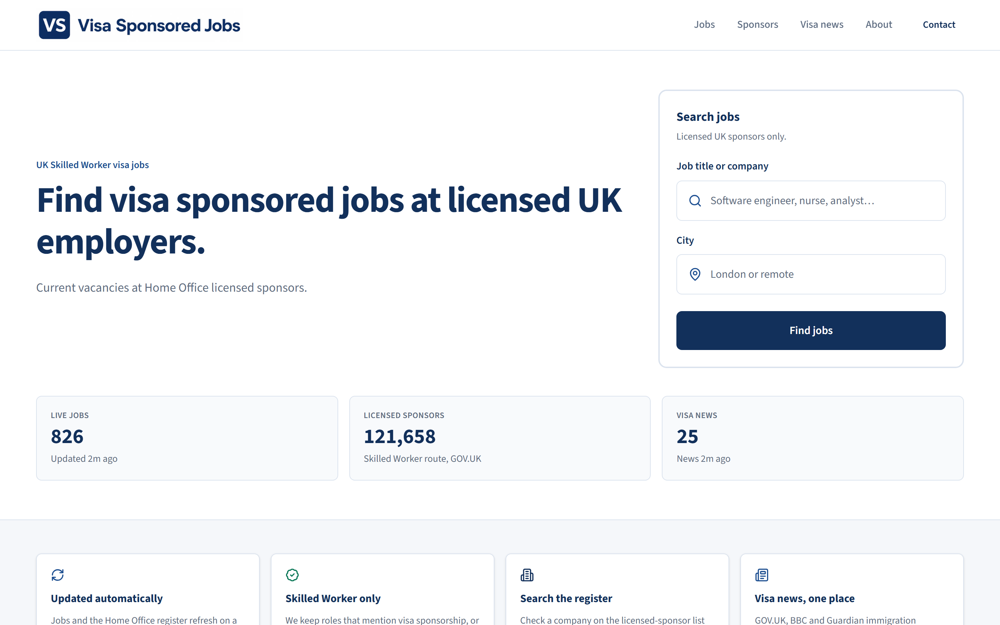
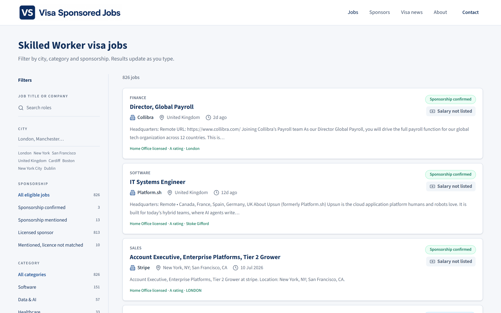
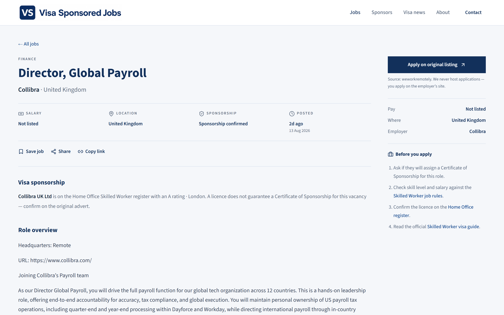
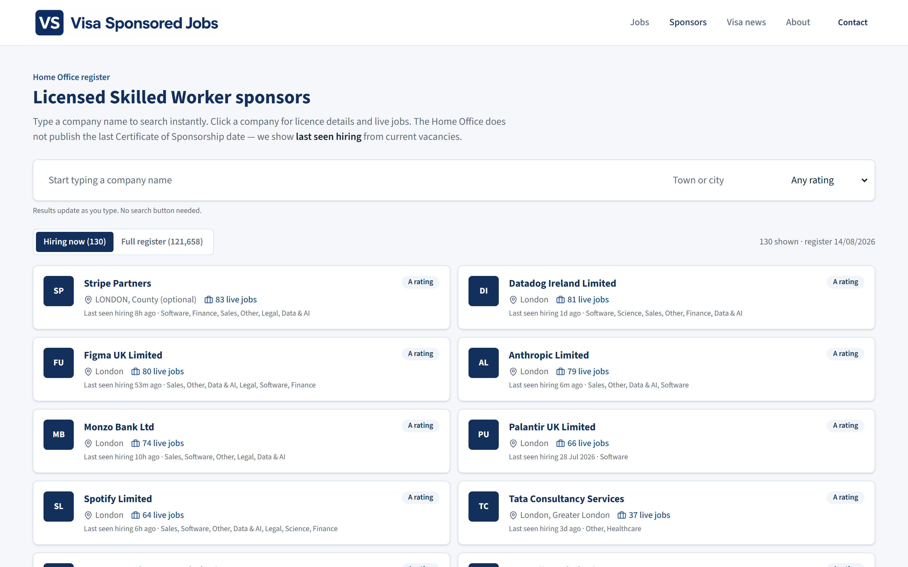
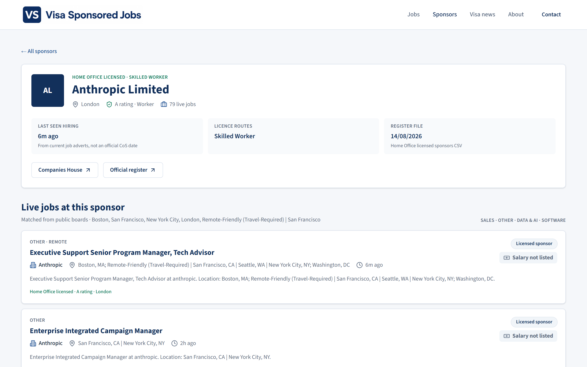
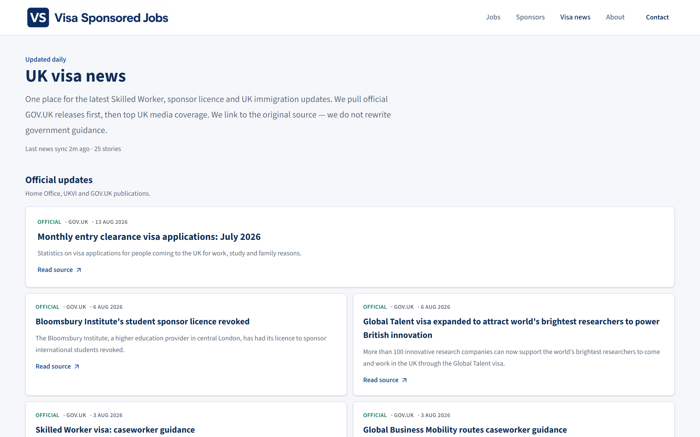
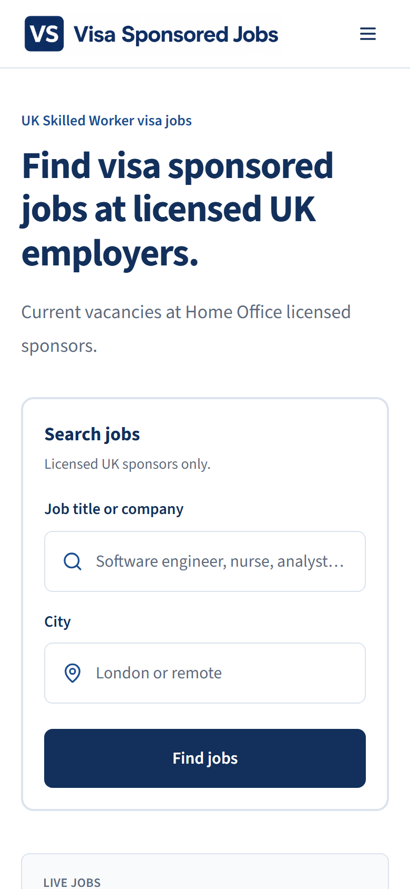
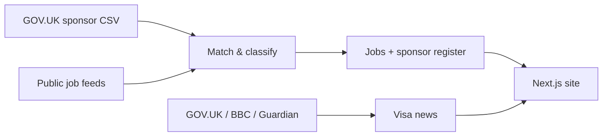

<p align="center">
  
</p>

<h1 align="center">Visa Sponsored Jobs</h1>

<p align="center">
  <strong>Find UK Skilled Worker visa jobs at Home Office licensed sponsors.</strong><br />
  Live vacancies, the official sponsor register, and daily visa news — in one place.
</p>

<p align="center">
  <a href="https://visa-sponsored-jobs-alpha.vercel.app"></a>
  <a href="https://visa-sponsored-jobs-alpha.vercel.app/jobs"></a>
  
  
  
</p>

<p align="center">
  <a href="https://visa-sponsored-jobs-alpha.vercel.app"><b>Live demo</b></a> ·
  <a href="https://visa-sponsored-jobs-alpha.vercel.app/jobs">Jobs</a> ·
  <a href="https://visa-sponsored-jobs-alpha.vercel.app/sponsors">Sponsors</a> ·
  <a href="https://visa-sponsored-jobs-alpha.vercel.app/news">Visa news</a> ·
  <a href="https://visa-sponsored-jobs-alpha.vercel.app/guide">Skilled Worker guide</a>
</p>

<p align="center">
  
</p>

Most UK job boards mix every vacancy together. The Home Office does publish a register of licensed sponsors — but it is a huge CSV, not a live jobs feed. **Visa Sponsored Jobs** matches current vacancies to that official Skilled Worker register, then adds daily UK visa news so you can search one site instead of ten tabs.

Developed by [Sagar Gondaliya](https://www.linkedin.com/in/sagar-gondaliya).

## Why people use it

- **Licensed sponsors only** — roles that mention visa / Skilled Worker sponsorship, or sit at a company on the current Home Office Worker register
- **121,000+ sponsors searchable** — look up a company even when they are not advertising right now
- **Hundreds of live jobs** — software, data, healthcare, finance, education and more, refreshed on a schedule
- **Sponsorship confidence** — confirmed in the advert, mentioned, or matched to a licensed employer
- **Daily visa news** — GOV.UK first, then BBC News and The Guardian, linked to the original source
- **You apply on the employer’s site** — this board never hosts applications

## Screenshots

### Search and filter live jobs

<p align="center">
  
</p>

### Confirm the licence before you apply

<p align="center">
  
</p>

### Search the official sponsor register

<p align="center">
  
</p>

<p align="center">
  
</p>

### UK visa news, one place

<p align="center">
  
</p>

<p align="center">
  
</p>

## How it works



1. Download the latest **Worker and Temporary Worker** register from GOV.UK and keep Skilled Worker licences.
2. Pull live vacancies from public job APIs and boards (Arbeitnow, We Work Remotely, Jobicy, ATS boards, Teaching Vacancies, The Muse, and optional [Adzuna](https://developer.adzuna.com) / [Reed](https://www.reed.co.uk/developers)).
3. Keep a role if the advert talks about visa sponsorship, **or** the employer matches a current Skilled Worker licence and does not say they cannot sponsor.
4. Publish searchable jobs, sponsor profiles, and daily visa news. Applications always happen on the original listing.

A licence does **not** guarantee a Certificate of Sponsorship for a specific role. Always confirm on [GOV.UK](https://www.gov.uk/skilled-worker-visa).

## Stack

| Layer | Choice |
| --- | --- |
| App | [Next.js](https://nextjs.org) 16 (App Router) + React 19 + TypeScript |
| UI | Tailwind CSS 4, Lucide icons |
| Data | Committed JSON in `data/`, refreshed by `npm run sync` |
| Hosting | Vercel |
| Freshness | GitHub Actions daily sync → commit `data/` → Vercel redeploy |

## Run locally

```bash
npm install
npm run sync
npm run dev
```

Open [http://localhost:3000](http://localhost:3000).

`npm run sync` downloads the latest GOV.UK sponsor CSV, public job feeds, and UK visa news. While the app is running locally, jobs refresh about every two hours and news at least daily.

### Optional extra job sources

Copy `.env.example` to `.env.local` and add free keys from [Adzuna](https://developer.adzuna.com) and [Reed](https://www.reed.co.uk/developers) for wider coverage. The site works without them.

```env
NEXT_PUBLIC_SITE_URL=https://your-domain.com
NEXT_PUBLIC_CONTACT_EMAIL=
ADZUNA_APP_ID=
ADZUNA_APP_KEY=
REED_API_KEY=
SYNC_SECRET=
```

Set `NEXT_PUBLIC_SITE_URL` on production so sitemap, robots and Open Graph tags use your live domain.

## Keeping production data fresh

Vercel’s filesystem is **read-only**, so `/api/sync` cannot update `data/` there. Production listings come from the JSON files committed in `data/`.

- **GitHub Actions** (`.github/workflows/sync-data.yml`) runs `npm run sync` daily and commits refreshed data; Vercel then redeploys
- Or run `npm run sync` locally and push the updated `data/` files
- Optional Adzuna / Reed keys can be added as repository secrets (`ADZUNA_APP_ID`, `ADZUNA_APP_KEY`, `REED_API_KEY`)

## Disclaimer

This is a discovery tool, not immigration advice, and it is not affiliated with UKVI or the Home Office. Check skill level, salary, English language and Certificate of Sponsorship rules on official GOV.UK guidance before you apply.

## Author

Built and maintained by **[Sagar Gondaliya](https://www.linkedin.com/in/sagar-gondaliya)** · [GitHub](https://github.com/Sagar610)

If this saves you a spreadsheet, star the repo and share it with someone hunting a Skilled Worker role.
